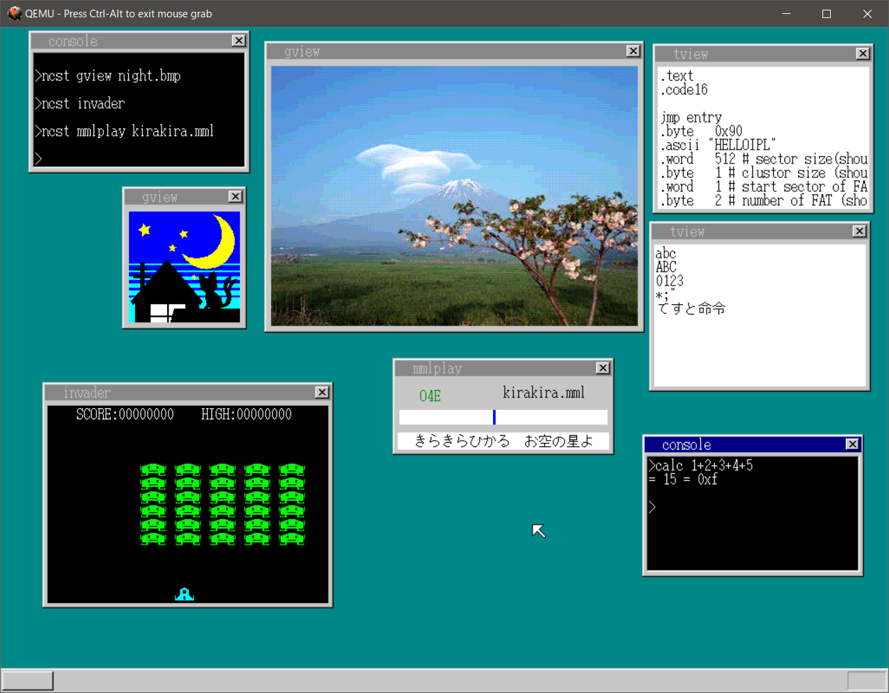

# HariboooteOS

## Prerequisites

Cコンパイラ: gcc 5.4.0  
アセンブラ: Gas(GNU assembler) 2.26.1  
リンカ: GNU ld 2.26.1  
x86エミュレータ: QEMU2.5.0  

## Usage

1. Clone this repository.
2. Run `make run` to start the HariboooteOS.(QEMU)

## License

This program is released under Unlicense.
